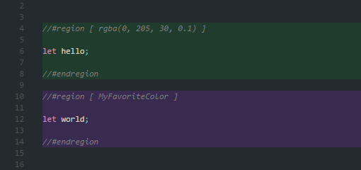
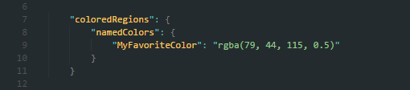
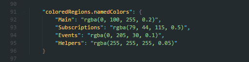
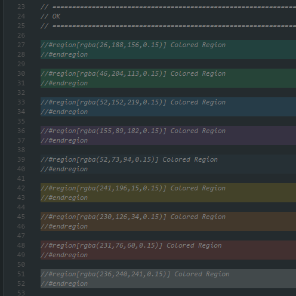
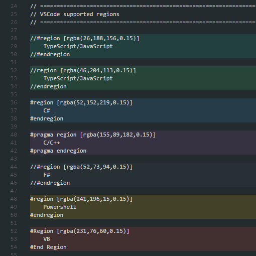

# Colored Regions for Visual Studio Code

This package provides a simple way of colorizing regions.

## Installation

Install through VS Code extensions. Search for `Colored Regions`

[Visual Studio Code Market Place: Colored Regions](https://marketplace.visualstudio.com/items?itemName=mihelcic.colored-regions)

Can also be installed using:

```
ext install colored-regions
```

## Features

Customize your regions by providing a `rgba(r, g, b, a)` color, or create a custom `named color` in **user settings** or **package.json** (workspace) and use it.

Define `coloredRegions.colorRange` array and use `#region` without explicit color definition.



## Settings

Settings will be read from (listed by priority):

1) package.json (workspace)



2) user settings



## Example



## Roadmap

1. Minimap support

## Release Notes

### 0.0.4
* Code refactoring and performance optimization.

* No glitchy backgrounds while typing inside the region, only the meaningful changes are sent to the editor.

* Added support for nested regions.

* Added support for Lua `--region` and `--[[ region ]]` comments.

* Added support for regions without explicit color and name: the values are taken from the `coloredRegions.colorRange` array.

* Added support for colors in `#region[#ddd]` and `#region[#dddddd50]` formats.

* If no last `#end region` is set, the last region extends to the end of the file.

### 0.0.3

* Added support for named colors


* Named colors defined in **package.json** (workspace)


* Named colors defined in **user settings**


### 0.0.2

* Added support for more languages




### 0.0.1

* MVP release
