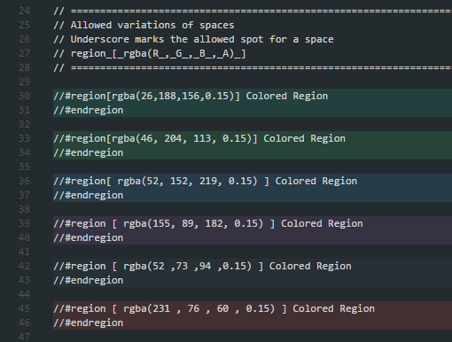

# Colored Regions for Visual Studio Code

This package provides a simple way of colorizing regions.

## Installation

Install through VS Code extensions. Search for `Colored Regions`

[Visual Studio Code Market Place: Colored Regions](https://marketplace.visualstudio.com/items?itemName=mihelcic.colored-regions)

Can also be installed using

```
ext install colored-regions
```

## Features

Customize your regions by providing a `rgba(r, g, b, a)` color.

```javascript
//#region [rgba(255, 255, 255, 0.15)] Hello region
const hello = () => 'region';
//#endregion
```

### Example


## Roadmap

1. Settings
2. Support for nested regions

## Release Notes

### 0.0.1

* MVP release

### 0.0.2

* Added support for more languages


* Added support for space variation in the color definition


